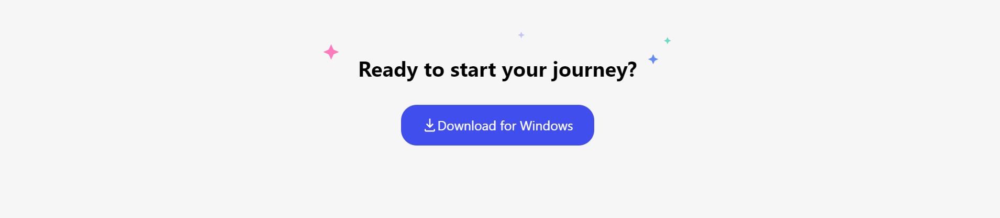

# Discord-UI-clone 

>## Features 

- Made Using HTML ,CSS,Tailwind css and Javascript
- Responsive on Mobile,Tablet and Desktop view.
- mobile screen hamburger menu toggle Feature

## Discord Website clone Using Tailwind CSS

## 🚀 Discord Clone UI Live Link 
 
- This Project is been Hosted on Netlify. [Project Live Link](https://assignment-website-clone.netlify.app/)

> ## Output 

  

